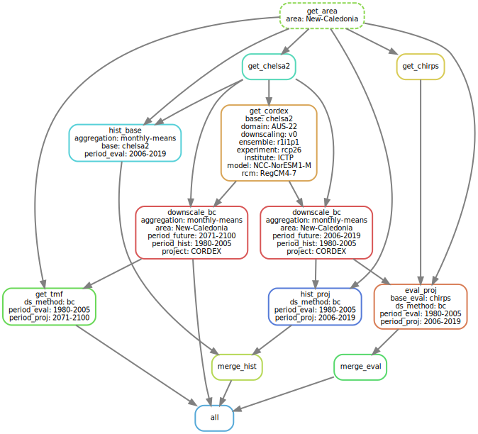

# DownClim - Downscale Climate Projections
Sylvain Schmitt -
Jul 8, 2024

- [Installation](#installation)
- [Credentials](#credentials)
- [Usage](#usage)
- [Configuration](#configuration)
- [Workflow](#workflow)
- [Data](#data)

[`snakemake`](https://github.com/sylvainschmitt/snakemake_singularity)
workflow to downscale climate projections.

<div>

[](https://www.repostatus.org/#wip)

</div>

The purpose of `DownClim` is to offer a tool for regional and national
climate projections including the mechanistic ‘dynamic’ downscaling of
the CORDEX initiative. `DownClim` is opposed to the direct statistical
downscaling of global climate projections found in WorldClim and CHELSA.
The approach is justified by an improvement in regional projections of
CORDEX compared to CMIP, although it can increase uncertainty and
sometimes be less reliable. The tool is an automated `snakemake`
workflow easily reproducible and scalable associated to `conda`
environments for enhance reproducibility and portability.



# Installation

This workflow is built on:

- [x] Python ≥3.5
- [x] [Mambaforge](https://github.com/conda-forge/miniforge#mambaforge)
- [x] Snakemake ≥5.24.1

``` bash
conda activate base
mamba create -c conda-forge -c bioconda -n snakemake snakemake
conda activate snakemake
snakemake --help
```

Once installed simply clone the workflow:

``` bash
git clone git@github.com:sylvainschmitt/DownClim.git
cd DownClim
snakemake -np 
```

# Credentials

Data are retrieve from the [Institut Pierre-Simon Laplace
node](https://esgf-node.ipsl.upmc.fr/search/cordex-ipsl/). You need
first to [create an
account](https://esgf.github.io/esgf-user-support/user_guide.html#create-an-account)
on this page ([create
account](https://esgf-node.ipsl.upmc.fr/user/add/?next=http://esgf-node.ipsl.upmc.fr/search/cordex-ipsl/)
link at corner right).

Then you’ll need to register credentials locally to use the workflow.
For that use a credentials_esgf yaml file reported in config.yml with
keys openid and pwd. For example using bash in linux:

``` bash
openid=https://esgf-node.ipsl.upmc.fr/esgf-idp/openid/{user}
pwd={pwd}
echo -e "openid: $openid\npwd: $pwd" > config/credentials_esgf.yml
```

# Usage

``` bash
module load bioinfo/Snakemake/7.20.0 # for test, adapt to your HPC
snakemake -np # dry run
snakemake --dag | dot -Tsvg > dag/dag.svg # dag
snakemake -j 1 --resources mem_mb=10000 # local run (test)
sbatch job.sh # HPC run with slurm
```

# Configuration

Different configuration parameters to set in
[`config/config.yml`](https://github.com/sylvainschmitt/DownClim/blob/main/config/config_ex.yml)
ordered by steps:

- Area
  - area: names of the area to work with, *e.g.* New-Caledonia.
- Time
  - time_frequency: time frequency of data (month “mon”, day “day” or
    x-hourly “3hr”), currently only “mon” is available.
  - hist_years: historical period on which to adjust projections, *e.g.*
    1980-2005.
  - eval_years: evaluation period on which to evaluate projections,
    *e.g.* 2006-2019.
  - proj_years: projection period on which to downscale the projections,
    *e.g.* 2071-2100.
- Variables
  - variables: used variables, *e.g.* temperature at surface ’tas”,
    minimum temperature “tasmin”, maximum temperature “tasmax”, and
    precipitations “pr” (currently only-one availables).
- Baseline
  - baseline: climate product for the baseline (CHELSA V2 “chelsa2” ,
    WorldClim V2 “worldclim2”, CRU TS V4 “cru4”, currently only chelsa2
    is available).
  - base_years: years to be retrieved from the baseline, *e.g.*
    1980-2019.
- Projection
  - projections: path to the file defining the requested projections on
    ESGF. An example can be found in
    [config/projections_ex.tsv](https://github.com/sylvainschmitt/DownClim/blob/main/config/projections_ex.tsv).
    [config/list_projections.py](https://github.com/sylvainschmitt/DownClim/blob/main/config/list_projections.py)
    helps generating the list.
  - domains: path to the file definingthe CORDEX domains corresponding
    to each country. An helper script to generate it should be added.
  - esgf_credentials: path to the file defining the user credentials on
    esgf, see credentials above.
- Downscaling
  - aggregation: time aggregation before downscaling, currently only
    “monthly-means” are available.
  - ds_method: downscaling method to be used (bias correction “bc”,
    quantile-based “qt”, currently only bc is available).
- Evaluation
  - base_eval: climate product for the evaluation (CHELSA V2 “chelsa2” ,
    WorldClim V2 “worldclim2”, CRU TS V4 “cru4”, currently only chelsa2
    is available).

# Workflow

### [get_area](https://github.com/sylvainschmitt/DownClim/blob/main/rules/get_area.py)

- Data: [GADM](https://gadm.org/)
- Script:
  [`get_area.py`](https://github.com/sylvainschmitt/DownClim/blob/main/scripts/get_area.py)
- Environment:
  [`gadm.yml`](https://github.com/sylvainschmitt/DownClim/blob/main/envs/gadm.yml)

Python script to get area limits with GADM if country or continent.

### [get_chelsa2](https://github.com/sylvainschmitt/DownClim/blob/main/rules/get_chelsa2.py)

- Data: [CHELSA V2.1](https://chelsa-climate.org/)
- Script:
  [`get_chelsa2.py`](https://github.com/sylvainschmitt/DownClim/blob/main/scripts/get_chelsa2.py)
- Environment:
  [`xarray.yml`](https://github.com/sylvainschmitt/DownClim/blob/main/envs/xarray.yml)

Python script to download, crop, adjust and aggregate CHELSA V2.1.

### [get_chirps](https://github.com/sylvainschmitt/DownClim/blob/main/rules/get_chirps.py)

- Data: [CHIRPS](https://www.chc.ucsb.edu/data/chirps)
- Script:
  [`get_chirps.py`](https://github.com/sylvainschmitt/DownClim/blob/main/scripts/get_chirps.py)
- Environment:
  [`xarray.yml`](https://github.com/sylvainschmitt/DownClim/blob/main/envs/xarray.yml)

Python script to download, crop, adjust and aggregate CHIRPS.

### [get_gshtd](https://github.com/sylvainschmitt/DownClim/blob/main/rules/get_gshtd)

- Data: [GSHTD](https://gee-community-catalog.org/projects/gshtd/)
- Script:
  [`get_gshtd.py`](https://github.com/sylvainschmitt/DownClim/blob/main/scripts/get_gshtd)
- Environment:
  [`xarray.yml`](https://github.com/sylvainschmitt/DownClim/blob/main/envs/xarray.yml)

Python script to download, crop, adjust and aggregate GSHTD.

### [get_cordex](https://github.com/sylvainschmitt/DownClim/blob/main/rules/get_cordex.py)

- Data: [CORDEX
  projections](https://esgf-node.ipsl.upmc.fr/search/cordex-ipsl/)
- Script:
  [`get_cordex.py`](https://github.com/sylvainschmitt/DownClim/blob/main/scripts/get_cordex2.py)
- Environment:
  [`xarray.yml`](https://github.com/sylvainschmitt/DownClim/blob/main/envs/xarray.yml)

Python script to download, crop, reproject, adjust, and aggregate CORDEX
projections.

### [get_cmip6](https://github.com/sylvainschmitt/DownClim/blob/main/rules/get_cmip6.py)

- Data: [CMIP6
  projections](https://console.cloud.google.com/marketplace/product/noaa-public/cmip6?)
- Script:
  [`get_cmip6.py`](https://github.com/sylvainschmitt/DownClim/blob/main/scripts/get_cmip6x.py)
- Environment:
  [`xarray.yml`](https://github.com/sylvainschmitt/DownClim/blob/main/envs/xarray.yml)

Python script to download, crop, reproject, adjust, and aggregate CMIP6
projections.

### [downscale_bc](https://github.com/sylvainschmitt/DownClim/blob/main/rules/downscale_bc.py)

- Script:
  [`downscale_bc.py`](https://github.com/sylvainschmitt/DownClim/blob/main/scripts/downscale_bc.py)
- Environment:
  [`xarray.yml`](https://github.com/sylvainschmitt/DownClim/blob/main/envs/xarray.yml)

Python script to compute downscaled projection with bias correction
(delta or change-factor method). Anomalies between historical and
projected periods are computed for the projections. Anomalies are
interpolated and added to the historical period of the baseline.

### [hist_base](https://github.com/sylvainschmitt/DownClim/blob/main/rules/hist_base.py)

- Script:
  [`hist_base.py`](https://github.com/sylvainschmitt/DownClim/blob/main/scripts/hist_base.py)
- Environment:
  [`xarray.yml`](https://github.com/sylvainschmitt/DownClim/blob/main/envs/xarray.yml)

Extract histograms of values for land of the baseline. Similarly,
[hist_proj](https://github.com/sylvainschmitt/DownClim/blob/main/rules/hist_proj.py)
extract histograms for the projection before and after downscaling.

### [merge_hist](https://github.com/sylvainschmitt/DownClim/blob/main/rules/merge_hist.py)

Merge all histograms.

### [eval_proj](https://github.com/sylvainschmitt/DownClim/blob/main/rules/eval_proj.py)

- Script:
  [`eval_proj.py`](https://github.com/sylvainschmitt/DownClim/blob/main/scripts/eval_proj.py)
- Environment:
  [`xarray.yml`](https://github.com/sylvainschmitt/DownClim/blob/main/envs/xarray.yml)

Compute evaluation metrics (CC, RMSEP, SDE, Bias) for the projection
before and after downscaling.

### [merge_eval](https://github.com/sylvainschmitt/DownClim/blob/main/rules/merge_eval.py)

Merge all evaluations.

### [map_bias](https://github.com/sylvainschmitt/DownClim/blob/main/rules/map_bias.py)

- Script:
  [`map_bias.py`](https://github.com/sylvainschmitt/DownClim/blob/main/scripts/map_bias.py)
- Environment:
  [`xarray.yml`](https://github.com/sylvainschmitt/DownClim/blob/main/envs/xarray.yml)

Compute bias maps for the downscaled projections.

### [merge_bias](https://github.com/sylvainschmitt/DownClim/blob/main/rules/merge_bias.py)

Merge all bias maps.

### [get_tmf](https://github.com/sylvainschmitt/DownClim/blob/main/rules/get_tmf.py)

- Script:
  [`get_tmf.py`](https://github.com/sylvainschmitt/DownClim/blob/main/scripts/get_tmf.py)
- Environment:
  [`xarray.yml`](https://github.com/sylvainschmitt/DownClim/blob/main/envs/xarray.yml)

Project Tropical Moist Forest climatic niche in the projection period.

# Data

## Baselines

[**CHELSA V2.1.1**](https://chelsa-climate.org/)**: Climatologies at
high resolution for the earth’s land surface areas**

*CHELSA (Climatologies at high resolution for the earth’s land surface
areas) is a very high resolution (30 arc sec, ~1km) global downscaled
climate data set currently hosted by the Swiss Federal Institute for
Forest, Snow and Landscape Research WSL. It is built to provide free
access to high resolution climate data for research and application, and
is constantly updated and refined.*

[**CHIRPS**](https://www.chc.ucsb.edu/data/chirps)**: Rainfall Estimates
from Rain Gauge and Satellite Observations**

*Climate Hazards Group InfraRed Precipitation with Station data (CHIRPS)
is a 35+ year quasi-global rainfall data set. Spanning 50°S-50°N (and
all longitudes) and ranging from 1981 to near-present, CHIRPS
incorporates our in-house climatology, CHPclim, 0.05° resolution
satellite imagery, and in-situ station data to create gridded rainfall
time series for trend analysis and seasonal drought monitoring.*

[**GSHTD**](https://gee-community-catalog.org/projects/gshtd/)**: Global
Seamless High-resolution Temperature Dataset**

*The Global Seamless High-resolution Temperature Dataset (GSHTD)
presented in this study offers a comprehensive and valuable resource for
researchers across various fields. Covering the period from 2001 to
2020, this dataset focuses on land surface temperature (Ts) and
near-surface air temperature (Ta). A unique feature of GSHTD is its
incorporation of seven types of temperature data, including clear-sky
daytime and nighttime Ts, all-sky daytime and nighttime Ts, and mean,
maximum, and minimum Ta. Notably, the dataset achieves global coverage
with an impressive 30 arcsecond or 1km spatial resolution.*

## Projections

[**CMIP**](https://wcrp-cmip.org/)**: Coupled Model Intercomparison
Project**

*CMIP is a project of the World Climate Research Programme (WCRP)
providing climate projections to understand past, present and future
climate changes. CMIP and its associated data infrastructure have become
essential to the Intergovernmental Panel on Climate Change (IPCC) and
other international and national climate assessments.*

[**CORDEX**](https://cordex.org/)**: Coordinated Regional Climate
Downscaling Experiment**

*The CORDEX vision is to advance and coordinate the science and
application of regional climate downscaling through global
partnerships.*
